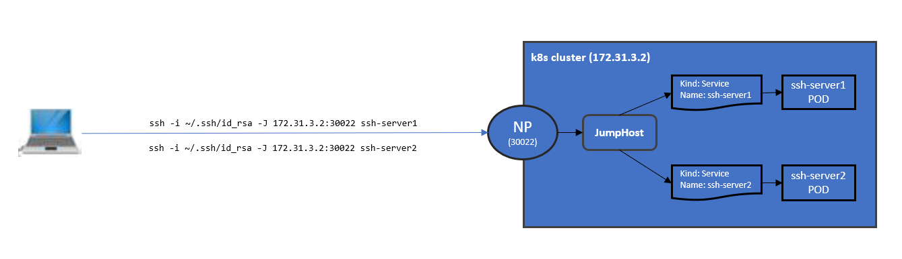

# SSH Jump host

POC for connecting user host (e.g. laptop) with back-end pods (a.k.a ray cluster nodes) without the need to externally expose individual node ports (e.g. NodePort)



Login to user host and perform the following in this order

**Note:** It is assumed you have `kubectl` installed and that it is pointing to the your kubernetes cluster

### build docker image

build and push common image that will be used for both ssh-jump host and server

image installs ssh and defines the none-admin user to ssh authenticate

**Note:** update image registry as needed

```
docker build -t 172.31.3.2:5000/sshjumpandserver:latest .
docker push 172.31.3.2:5000/sshjumpandserver:latest
```

### create secret

create secret for your public key. It will be automatically added to 'authorized_keys' file in ssh-jumphost and server

```
kubectl create secret generic ssh-key-secret-laptop --from-file=ssh-publickey=$HOME/.ssh/id_rsa.pub
```

### deploy ssh-server(s)

```
kubectl apply -f ./deploy/ubuntu-sshserver.yaml
```

```
kubectl apply -f ./deploy/ubuntu-sshserver2.yaml
```

### deploy ssh-jumphost

automatically exposes ssh port 22 through nodeport (30022)

```
kubectl apply -f ./deploy/ubuntu-sshjumphost.yaml
```

### update ssh config

append the below to ~/.ssh/config

```
Host ubuntu-sshserver
  # internal pod ipaddress
  # or service name of this pod
  HostName sshserver
  User weit
  IdentityFile /home/weit/.ssh/id_rsa
  IdentitiesOnly yes
  ForwardAgent yes
  StrictHostKeyChecking no
  UserKnownHostsFile=/dev/null
  GlobalKnownHostsFile=/dev/null
  # nodeport
  ProxyJump 172.31.3.2:30022

Host ubuntu-sshserver2
  # internal pod ipaddress
  # or service name of this pod
  HostName sshserver2
  User weit
  IdentityFile /home/weit/.ssh/id_rsa
  IdentitiesOnly yes
  ForwardAgent yes
  StrictHostKeyChecking no
  UserKnownHostsFile=/dev/null
  GlobalKnownHostsFile=/dev/null
  # nodeport
  ProxyJump 172.31.3.2:30022
```

### SSH into ssh server via jump host

you can either provide explicit pod ip or pod's service name

`ssh  -i ~/.ssh/id_rsa -J 172.31.3.2:30022 10.244.2.125` or `ssh  -i ~/.ssh/id_rsa  -J 172.31.3.2:30022 sshserver`

another option would be to ssh into `<Host>` which is defined under ~/.ssh/config:

`ssh ubuntu-sshserver`, `ssh ubuntu-sshserver2`
